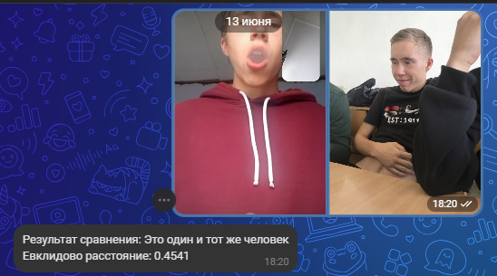
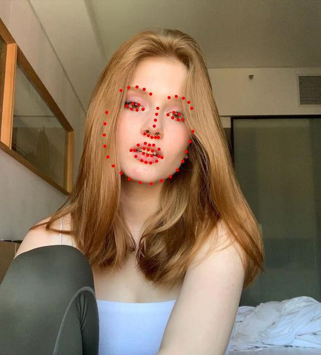
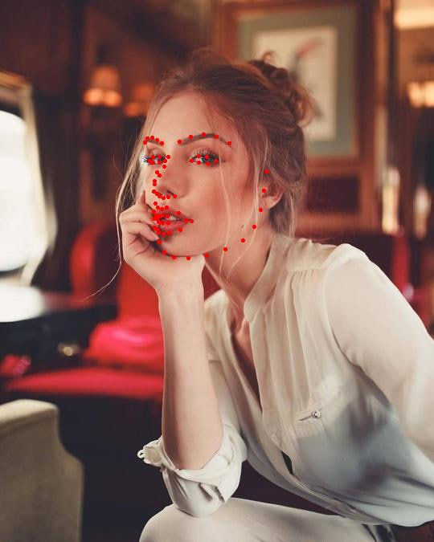

# Face Recognition Dlib VK Bot 🤖

**face_recognition_dlib** — это бот для ВКонтакте, который сравнивает лица на двух фотографиях, используя dlib и современные методы компьютерного зрения.

## Возможности 🚀

- Принимает два фото от пользователя ВКонтакте.
- Определяет, один и тот же человек на фото или нет (по евклидову расстоянию эмбеддингов лиц).
- Возвращает результат сравнения и аннотированные изображения с отмеченными ключевыми точками лица.
- Ведёт логирование работы.

## Визуализация работы 🖼️

Пример исходных и аннотированных изображений:

### Ответ если пользотваель отправил кол-во фото != 2
<p align="center">

</p>
___

### Результаты работы программы




|        Оригинал 1         |        Оригинал 2         |     Аннотированное 1      |     Аннотированное 2      |
| :-----------------------: | :-----------------------: | :-----------------------: | :-----------------------: |
|  |  |  |  |

## Структура проекта 📁

- `main.py` — основной бот для VK, обрабатывает сообщения и вызывает сравнение лиц.
- `script.py` — функции для обработки и сравнения лиц, аннотирования изображений.
- `datasets/` — содержит необходимые предобученные модели dlib:
  - `shape_predictor_68_face_landmarks.dat`
  - `dlib_face_recognition_resnet_model_v1.dat`
- `requirements.txt` — зависимости Python.
- `bot.log` — лог-файл работы бота.

## Установка ⚙️

1. **Клонируйте репозиторий и перейдите в папку:**

   ```bash
   git clone <repo_url>
   cd face_recognition-dlib-
   ```

2. **Установите зависимости:**

   ```bash
   pip install -r requirements.txt
   pip install dlib.whl
   ```

3. **Скачайте и поместите модели в папку `datasets/`:**

   - `shape_predictor_68_face_landmarks.dat`
   - `dlib_face_recognition_resnet_model_v1.dat`
     (Они уже включены в репозиторий, если нет — скачайте с официальных источников dlib.)

4. **Создайте файл `VK_API_KEY.py` в корне проекта:**
   ```python
   VK_API_KEY = "ваш_токен_от_группы_ВК"
   ```

## Запуск ▶️

```bash
python main.py
```

Бот начнёт слушать новые сообщения в вашей группе VK.

## Пример работы 💬

1. Пользователь отправляет два фото одним сообщением.
2. Бот отвечает, совпадают ли лица, и присылает аннотированные изображения.

## Зависимости 📦

- vk_api==11.9.9
- scikit-image==0.22.0
- scipy==1.13.0
- numpy==1.26.4
- Pillow==10.1.0
- dlib (через dlib.whl)
